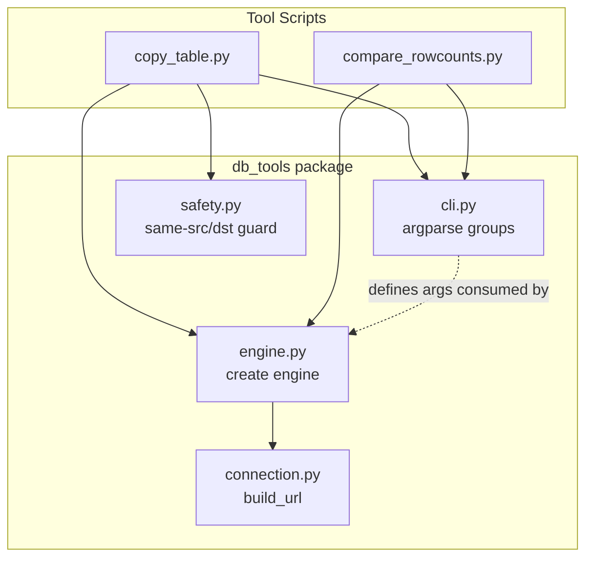

# Design Document: db-tools-modularization

## Overview

This design extracts the duplicated logic from `copy_table.py` and `compare_rowcounts.py` into a shared `db_tools` Python package. Both scripts currently duplicate: ODBC connection-string construction (`build_url`), argparse CLI setup for server/auth arguments, and SQLAlchemy engine creation. The refactored package provides three core modules — connection building, CLI argument groups, and engine factory — plus a safety-guard utility. The existing tool scripts are then rewritten as thin wrappers that import from `db_tools`.

The package is structured for installation via `pyproject.toml` using `uv` (or pip), and strictly follows the data-only principle: no DDL is ever issued.

## Architecture



The dependency flow is strictly one-directional: tool scripts depend on `db_tools`, and within the package `engine.py` depends on `connection.py`. There are no circular dependencies.

### Key Design Decisions

1. **Flat package, no sub-packages.** The shared logic is small (4 modules). A flat `db_tools/` package keeps imports simple (`from db_tools.connection import build_url`).

2. **Functions over classes.** The existing code is procedural. We keep it that way — `build_url()`, `add_single_server_args()`, `create_engine_from_params()` are plain functions. A dataclass is used only for `ConnectionParams` to bundle related values.

3. **Argument names stay compatible.** `compare_rowcounts` uses `--server1`/`--server2` today, but the requirements specify `--server`/`--database` for single-server and `--src-`/`--dst-` for dual-server. The refactored CLI module adopts the requirement naming. The compare-rowcounts tool uses two calls to the single-server argument group with distinct prefixes (`--server1`/`--server2`) to maintain its two-server nature while reusing the shared group.

4. **Safety guard is a pure function.** `check_same_server_database(src, dst)` raises `ValueError` — no side effects, easy to test.

## Components and Interfaces

### db_tools/connection.py

```python
def build_url(
    server: str,
    database: str,
    username: str | None = None,
    password: str | None = None,
    trusted: bool = False,
) -> str:
    """Build a SQLAlchemy connection URL for SQL Server via ODBC Driver 18.
    
    Always sets TrustServerCertificate=yes.
    URL-encodes the ODBC parameter string.
    """
```

### db_tools/cli.py

```python
def add_single_server_args(
    parser: argparse.ArgumentParser,
    prefix: str = "",
) -> None:
    """Add --server, --database, --user, --password, --trusted args.
    
    When prefix is non-empty (e.g. "server1"), argument names become
    --server1-server, --server1-database, etc.
    """

def add_dual_server_args(
    parser: argparse.ArgumentParser,
) -> None:
    """Add --src-server, --src-db, --src-user, --src-pass, --dst-* args."""

def add_schema_arg(
    parser: argparse.ArgumentParser,
    default: str = "dbo",
) -> None:
    """Add --schema argument with the given default."""
```

### db_tools/engine.py

```python
def create_engine_from_params(params: ConnectionParams) -> sqlalchemy.Engine:
    """Create a SQLAlchemy engine from ConnectionParams.
    
    Delegates URL construction to connection.build_url().
    """
```

### db_tools/safety.py

```python
def check_same_server_database(
    src: ConnectionParams,
    dst: ConnectionParams,
) -> None:
    """Raise ValueError if src and dst refer to the same server+database.
    
    Comparison is case-insensitive.
    """
```

### db_tools/__init__.py

Re-exports the public API:
- `build_url`
- `ConnectionParams`
- `create_engine_from_params`
- `add_single_server_args`, `add_dual_server_args`, `add_schema_arg`
- `check_same_server_database`


### Refactored Tool Scripts

**copy_table.py** — Uses `add_dual_server_args()` + `add_schema_arg()` from CLI module, `create_engine_from_params()` from engine module, and `check_same_server_database()` from safety module. The `copy_table()` function itself stays in the script (it's tool-specific logic). No `--create` flag. Exits with error if destination table doesn't exist.

**compare_rowcounts.py** — Uses `add_single_server_args()` twice (with prefixes `"server1"` and `"server2"`) + `add_schema_arg()`, and `create_engine_from_params()`. The `get_rowcounts()` function and reporting logic stay in the script.

## Data Models

### ConnectionParams

```python
from dataclasses import dataclass

@dataclass(frozen=True)
class ConnectionParams:
    server: str
    database: str
    username: str | None = None
    password: str | None = None
    trusted: bool = False
```

This is the single structured representation passed between CLI parsing, engine creation, and safety checks. It is frozen (immutable) to prevent accidental mutation after construction.

### Connection URL Format

The generated URL follows this pattern:

```
mssql+pyodbc:///?odbc_connect=<url-encoded ODBC string>
```

Where the ODBC string is:

```
driver=ODBC+Driver+18+for+SQL+Server;server=<server>;database=<database>;TrustServerCertificate=yes;[Trusted_Connection=yes | uid=<user>;pwd=<pass>]
```


## Correctness Properties

*A property is a characteristic or behavior that should hold true across all valid executions of a system — essentially, a formal statement about what the system should do. Properties serve as the bridge between human-readable specifications and machine-verifiable correctness guarantees.*

### Property 1: Connection URL structure invariants

*For any* server name, database name, and credential combination (trusted or SQL auth), `build_url()` shall return a string that starts with `mssql+pyodbc:///?odbc_connect=`, contains `ODBC+Driver+18+for+SQL+Server` as the driver, contains `TrustServerCertificate=yes`, and contains the provided server and database values within the decoded ODBC parameter string.

**Validates: Requirements 1.1, 1.4**

### Property 2: Auth mode matches trusted flag

*For any* ConnectionParams, if `trusted` is `True` then the decoded ODBC string from `build_url()` shall contain `Trusted_Connection=yes` and shall not contain `uid=` or `pwd=`; if `trusted` is `False` and username/password are provided, the decoded ODBC string shall contain `uid=<username>` and `pwd=<password>` and shall not contain `Trusted_Connection=yes`.

**Validates: Requirements 1.2, 1.3**

### Property 3: URL encoding round-trip

*For any* server name, database name, and password containing special characters (spaces, semicolons, ampersands, equals signs, percent signs), the URL produced by `build_url()` shall, when the `odbc_connect` query parameter is URL-decoded, yield an ODBC string that contains the original server, database, and password values verbatim.

**Validates: Requirements 1.5**

### Property 4: Engine factory delegates to build_url

*For any* ConnectionParams, the SQLAlchemy engine returned by `create_engine_from_params()` shall have a URL string equal to the value returned by `build_url()` called with the same parameters.

**Validates: Requirements 3.1, 3.2**

### Property 5: Engine creation is deterministic

*For any* ConnectionParams, calling `create_engine_from_params()` twice with the same input shall produce engines whose URL strings are identical.

**Validates: Requirements 3.3**

### Property 6: Same-server-database detection

*For any* two ConnectionParams where the server and database strings are identical under case-insensitive comparison, `check_same_server_database()` shall raise `ValueError`. *For any* two ConnectionParams where either the server or database differs (case-insensitively), the function shall not raise.

**Validates: Requirements 7.1, 7.2**

## Error Handling

| Scenario | Component | Behavior |
|---|---|---|
| Destination table does not exist | copy_table.py | `sys.exit()` with message: "Error: {schema}.{table} does not exist on destination. Schema must be deployed separately." |
| Source table does not exist | copy_table.py | `sys.exit()` with message listing available tables or suggesting a case-insensitive match |
| Same source and destination | db_tools/safety.py | `ValueError` raised with descriptive message |
| Missing credentials when trusted=False | db_tools/connection.py | Let SQLAlchemy/pyodbc raise the connection error naturally (no pre-validation needed — the driver gives a clear error) |
| No tables found in schema | compare_rowcounts.py | `sys.exit("No tables found in the specified schema.")` |
| `--create` flag passed | copy_table.py | argparse rejects unrecognized argument (no `--create` flag defined) |

All error paths produce a non-zero exit code. No DDL is ever issued in any error-recovery path.

## Testing Strategy

### Unit Tests (pytest)

Unit tests cover specific examples, edge cases, and integration points:

- **connection.py**: Verify URL output for a known server/database/credential combination (example). Verify trusted=True omits credentials (example). Verify a password containing `;` and `=` is properly encoded (edge case).
- **cli.py**: Verify `add_single_server_args` adds the expected argument names. Verify `add_dual_server_args` adds `--src-*` and `--dst-*` arguments. Verify `add_schema_arg` defaults to `"dbo"`. Verify prefixed single-server args work correctly.
- **safety.py**: Verify same server/db raises ValueError (example). Verify different server same db passes (example). Verify case variations are caught (edge case).
- **engine.py**: Verify returned object is a `sqlalchemy.Engine` (example).
- **copy_table.py**: Verify `--create` flag is not accepted (example). Verify missing destination table produces the expected error message (requires mock, example).
- **compare_rowcounts.py**: Verify CLI args parse correctly after refactor (example).

### Property-Based Tests (Hypothesis)

The project shall use the [Hypothesis](https://hypothesis.readthedocs.io/) library for property-based testing. Each property test runs a minimum of 100 iterations.

Each test must be tagged with a comment referencing the design property:

```python
# Feature: db-tools-modularization, Property 1: Connection URL structure invariants
```

Property tests to implement:

1. **Property 1** — Generate random server/database/credential combos via `st.text()`. Assert URL structure invariants hold.
2. **Property 2** — Generate random ConnectionParams with `trusted` as `st.booleans()`. Assert auth mode in decoded URL matches the flag.
3. **Property 3** — Generate strings containing special characters (`; = & % +` space). Assert URL-decode round-trip preserves original values.
4. **Property 4** — Generate random ConnectionParams. Assert engine URL equals `build_url()` output.
5. **Property 5** — Generate random ConnectionParams. Call `create_engine_from_params()` twice, assert URLs match.
6. **Property 6** — Generate random server/database strings. Construct two ConnectionParams with same values (varying case). Assert `check_same_server_database()` raises. Generate two with differing values, assert it does not raise.

### Test Configuration

- Test framework: `pytest`
- Property testing library: `hypothesis`
- Add to `pyproject.toml` dev dependencies: `pytest`, `hypothesis`
- Each property-based test: minimum `@settings(max_examples=100)`
- Each property-based test: tagged with `# Feature: db-tools-modularization, Property N: <title>`
